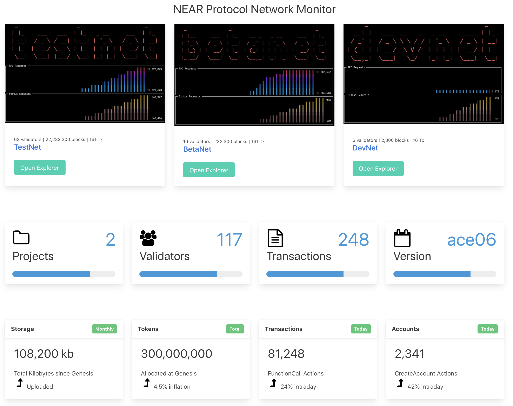
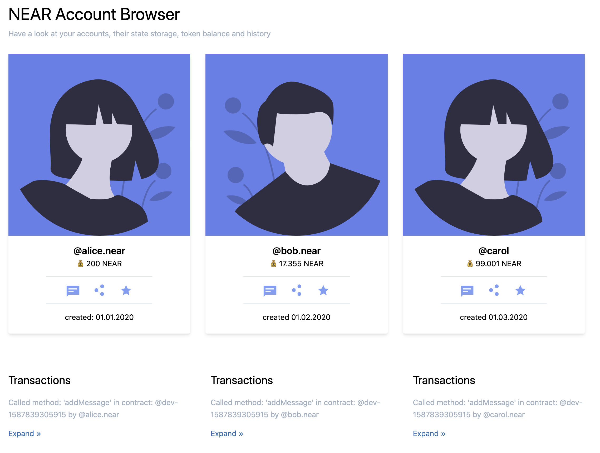
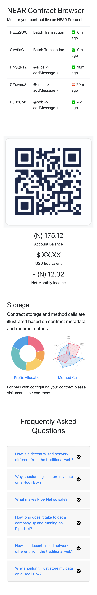

# NEAR Hackathon Starter Kit

This starter kit includes 3 project templates:

- NEAR Network Monitor
- NEAR Account Monitor
- NEAR Contract Monitor

## NEAR Network Monitor

<table>
<tr><td>Screenhot</td><td>Features</td></tr>
<tr>
  <td></td>
  <td>
Motivation

- there's some data out there, let's get it
- customizing your own dashboard is a useful exercise

NEAR Protocol Components

- JSON RPC API

Dependencies

- uses [Bulma CSS]()

  </td>
</tr>
<tr><td colspan="2"><pre>
near-network-monitor
  ├── README.md
  ├── README.txt
  ├── package.json
  ├── public
  │   ├── css
  │   ├── favicon.ico
  │   ├── images
  │   ├── index.html
  │   ├── js
  │   ├── placeholder
  │   └── robots.txt
  └── src
      ├── index.pug
      └── scss
</pre></td></tr>
</table>

## NEAR Account Monitor

<table>
<tr><td>Screenhot</td><td>Features</td></tr>
<tr>
  <td></td>
  <td>

Motivation

- we may have more than one account
- seeing all of these accounts side by side is helpful

NEAR Protocol Components

- NEAR Wallet
- `near-api-js`

Dependencies

- uses [Tailwind CSS]()

  </td>
</tr>
<tr><td colspan="2"><pre>
near-account-monitor
  ├── README.md
  ├── README.txt
  ├── package.json
  ├── public
  │   ├── css
  │   ├── favicon-tailwind.png
  │   ├── index.html
  │   ├── js
  │   ├── placeholders
  │   └── robots.txt
  └── src
      ├── index.pug
      └── tailwind
</pre></td></tr>
</table>

## NEAR Contract Monitor

<table>
<tr><td>Screenhot</td><td>Features</td></tr>
<tr>
  <td></td>
  <td valign="top">
Motivation

- contract owners must monitor their contract for fitness
- knowing the source of costs like large storage is useful

NEAR Protocol Components

- NEAR Wallet
- `near-api-js`

Dependencies

  - uses [Bootstrap CSS]()

<pre>
near-contract-monitor
  ├── README.md
  ├── README.txt
  ├── package.json
  ├── public
  │   ├── css
  │   ├── favicon.ico
  │   ├── images
  │   ├── index.html
  │   ├── js
  │   ├── placeholder
  │   └── robots.txt
  └── src
      ├── index.pug
      └── scss
</pre>
  </td>
</tr>

</table>

